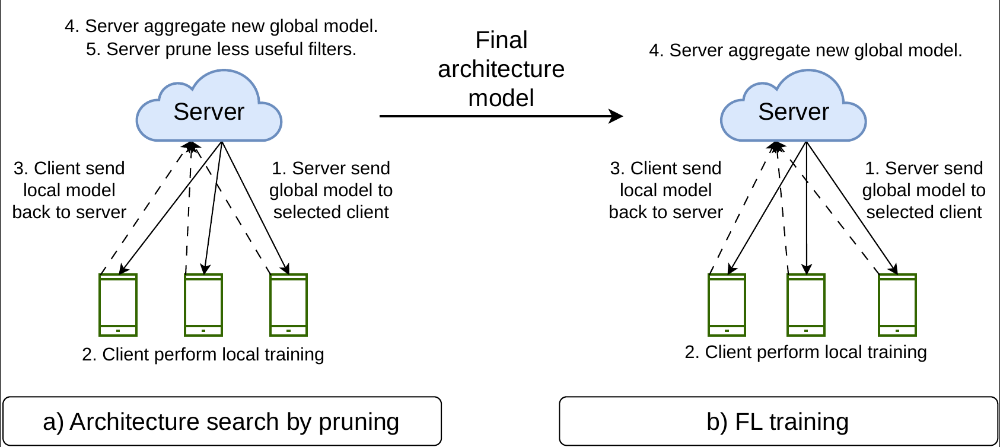

# Automatic Structured Pruning for Efficient Model Architectures in Federated Learning

In this project, we proposed a new pruning method in the Federated Learning (FL) system. 

# 1. Overview

An overview of our pruning in Federated Learning system:

# 2. Code information

- `config.py`: dataset path and hyper-parameters.

- `fl_cnn_prune.ipynb`: execute the training and pruning CNN model on the FL system.

- Folder `utils`: utility functions and helper modules:

    + `model_utils.py`: helper function to build model architecture.
    + `read_data_utils.py`: helper function to read dataset.
    + `pruning_utils.py`: helper function to prune model.

### RUN THE CODE:
- You can simply run the whole file `fl_cnn_prune.ipynb` to inspect the result.
- You can also tune hyper-parameters in the `config.py` file.

# 4. Dataset information
Currently, we only run the experiment with the FEMNIST dataset. 

In the future, we plan to run on the CELEB dataset with complex (Residual block) network.

| Dataset | Number of clients | Number of categories |Image size 
| --- | --- | --- | --- | 
| FEMNIST | 3 383 | 62 | 28 x 28 |

# 5. Performance

- FL round: Number of FL training round.
- Number client: Number (or percentage) of clients selected per round.
- Local epoch: Number of local epochs each client train locally for FedAvg.
- Local batch: batch size for each client train locally.

| Dataset | FL round | Number client | Local epoch | Local batch | Accuracy |
| --- | --- | --- | --- | --- | --- |
| FEMNIST | 100 | 10% | 10 | 32 | 74.22% |